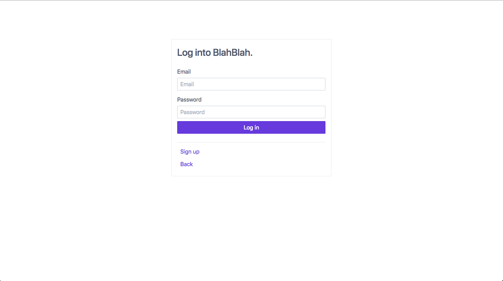
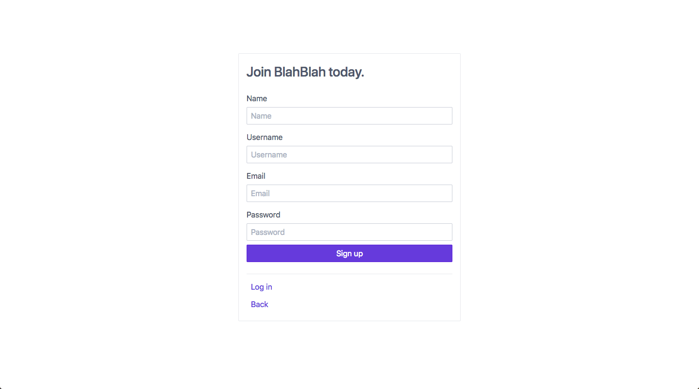
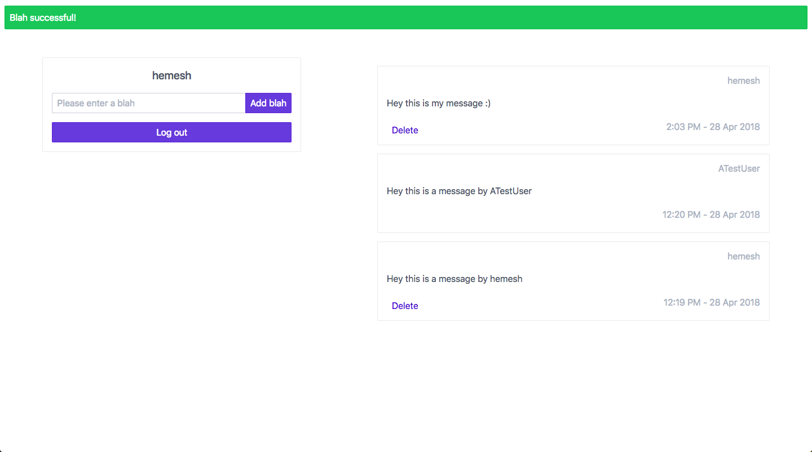

[](https://travis-ci.org/makersacademy/chitter-challenge) [](https://codeclimate.com/github/Hemesh-Unka/BlahBlah/maintainability) [](https://codeclimate.com/github/Hemesh-Unka/BlahBlah/test_coverage)

#  BlahBlah Aka Chitter Challenge
**Makers Academy - Weekend Challenge 4**

## Task

This was a weekend challenge where I was tasked to build a small lightweight twitter clone in Ruby.

## Aim
My main focus for this project was to cement my knowledge gained during the week. As always, I approached this project in a test driven manner which allowed me to build my project with confidence when adding new features.

## Reflection

**19/03/18**
I found that I began to get a good flow of how to approach implementing new features. I would first start with my feature tests, then implement the visual side of the feature. I would then to begin to write my logic tests and then finally implement the logic required for the feature to work.

**Difficulties:** I hadn't come across implementing an authentication system as of yet, therefore I felt that this was probably the most difficult part of the project. I also should of that I should have the database column names (blahs) should of have been named more suitably (posts).

**28/04/18**
I came back to this code after completing the [acebook-pinkfish](acebook-pinkfish) group project. I felt this project gave me more of a understanding to what was happening behind the scenes when working with Ruby on Rails.

Having built this project from the ground up, The existing structure of the code allowed me to easily implement a few more features to this repo such as deleting blahs(posts).

I also gained more of an understanding towards restful routing and the use of multiple controllers for a project.

#### To Do
- [ ] Host a live version of the site
- [ ] Implement advanced features
- [ ] Implement: In order to start a conversation as a maker I want to reply to a peep from another maker
- [ ] Fix: User should not be able to register with blank details
- [x] Complete CSS Styling (Spectre CSS Framework)
- [x] Implement delete blah feature
- [x] Finish README
- [x] Refactor code and tests as required
- [x] Fix database build bug

## Screenshots




## User Stories
```
As a Maker
So that I can let people know what I am doing  
I want to post a message (peep) to chitter

As a maker
So that I can see what others are saying  
I want to see all peeps in reverse chronological order

As a Maker
So that I can better appreciate the context of a peep
I want to see the time at which it was made

As a Maker
So that I can post messages on Chitter as me
I want to sign up for Chitter

HARDER

As a Maker
So that only I can post messages on Chitter as me
I want to log in to Chitter

As a Maker
So that I can avoid others posting messages on Chitter as me
I want to log out of Chitter

ADVANCED

As a Maker
So that I can stay constantly tapped in to the shouty box of Chitter
I want to receive an email if I am tagged in a Peep
```

## Getting Started
1. Clone or download the repository onto your system `https://github.com/Hemesh-Unka/chitter-challenge.git`
2. Redirect into the home directory `cd chitter-challenge`
3. Ensure you have [Bundler](http://bundler.io/) installed. Once installed, in the command line type `bundle` to install required dependencies listed in the GemFile
4. Ensure you have [HomeBrew package manager for macOs](https://brew.sh/) installed. Install `postgres` by typing `brew install postgresql`
5. Run `rack setup` to setup up the required databases to run this application
4. Type `rackup` to run the server
5. Finally in your browser navigate to `localhost:9292` to view the app

## Testing
Tests were designed to run using the RSpec and Capybara testing frameworks. In the home directory of the chitter-challange type `rspec` to run all RSpec tests.

## Tech Stack

* Ruby
* Sinatra
* Sinatra-Flash
* PostgreSQL
* Bcrypt
* Rubocop
* RSpec
* Capybara
* Rake
* Travis
